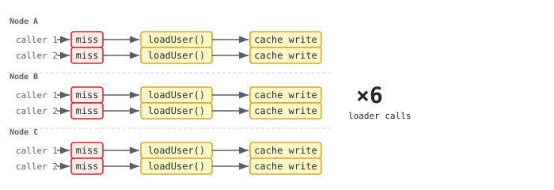
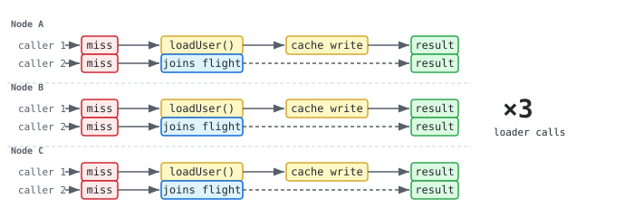
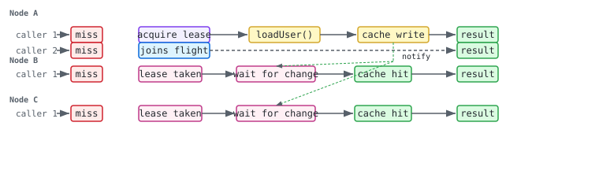
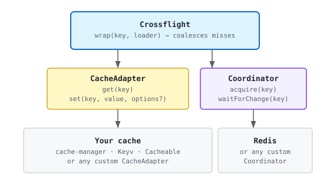

[](https://scorecard.dev/viewer/?uri=github.com/gkoos/crossflight)


# Crossflight

Cross-process cache stampede protection for the cache you already use.

```ts
const crossflight = createCrossflight({
  cache: existingCacheAdapter,
  coordinator: redisCoordinator(redis),
})

const user = await crossflight.wrap(
  "user:123",
  () => loadUser("123"),
  { ttl: 60_000 },
)
```

## What it does

When multiple processes miss the same cache key simultaneously, each of them will independently run the loader unless something coordinates between them. Most cache libraries already solve the within-process version of this problem by coalescing concurrent misses into a single in-flight Promise. That is not enough once the application runs on more than one server.

Crossflight adds a distributed coordinator to the picture. One process acquires ownership of the key, runs the loader, and writes the result to the cache. Every other caller, regardless of which process they live in, waits for that result rather than running their own copy of the same work.

### Without coalescing

Every caller across every process independently runs the loader.



### With in-process coalescing only

Callers within the same process share one in-flight Promise, but each process still runs the loader independently. This is what most cache libraries give you.



### With distributed coalescing

One process acquires ownership, runs the loader once, and writes the result. Every other caller waits for that result.



## Architecture

Crossflight is built around two separate contracts.



The `CacheAdapter` describes how values are stored and retrieved. The `Coordinator` describes how ownership is acquired and how processes signal each other when a key changes. Crossflight depends on these two interfaces and knows nothing about the backing storage or the coordination mechanism.

The cache and the coordinator do not need to be the same system. You can use cache-manager backed by Memcached for values and Redis for coordination, or any combination that satisfies the interfaces. Redis is the first coordinator implementation, not a definition of what a coordinator has to be.

## Installation

```sh
npm install crossflight ioredis
```

## Getting started

```ts
import { createCrossflight } from 'crossflight'
import { redisCoordinator } from 'crossflight/coordinators/redis'
import { cacheManagerAdapter } from 'crossflight/adapters/cache-manager'
import { Redis } from 'ioredis'

const redis = new Redis()

const crossflight = createCrossflight({
  cache: cacheManagerAdapter(cacheManager),
  coordinator: redisCoordinator(redis),
})

const value = await crossflight.wrap(
  'product:42',
  () => fetchProductFromDatabase(42),
  { ttl: 30_000 },
)

// When you're done
await crossflight.close()
await redis.quit()
```

See the [Redis coordinator guide](docs/redis-coordinator.md) for the built-in distributed coordination behavior, key layout, and lease semantics.

## Adapters

Built-in adapters are available for cache-manager, Keyv, and Cacheable:

```ts
import { cacheManagerAdapter } from 'crossflight/adapters/cache-manager'
import { keyvAdapter }         from 'crossflight/adapters/keyv'
import { cacheableAdapter }    from 'crossflight/adapters/cacheable'
```

If your cache library is not on that list, the interface is two methods:

```ts
interface CacheAdapter {
  get<T>(key: string): Promise<{ hit: true; value: T } | { hit: false }>
  set<T>(key: string, value: T, options?: { ttl?: number }): Promise<void>
}
```

The reason `get` returns a discriminated union rather than a nullable value is that `undefined` is a valid cached result in many applications; a nullable return would make a genuine hit indistinguishable from a miss.

## Configuration

All options passed to `createCrossflight()`:

| Option | Type | Default | Description |
| --- | --- | --- | --- |
| `cache` | `CacheAdapter` | required | Cache backend adapter |
| `coordinator` | `Coordinator` | required | Distributed coordination backend |
| `failureMode` | `'fail-closed' \| 'fail-open'` | `'fail-closed'` | Fall back to running the loader when coordination fails |
| `defaultTimeoutMs` | `number` | none | Per-call timeout in ms |
| `defaultTtlMs` | `number` | `30000` | Default lease TTL when not specified per call |
| `maxRetryAttempts` | `number` | `64` | Distributed retry limit before throwing `CoordinationTimeoutError` |
| `retryBackoff` | `(attempt: number) => number` | stepped 25–200ms | Wait duration per retry attempt |
| `onEvent` | `(event: CrossflightEvent) => void` | none | Observability hook |
| `onEventError` | `(error: unknown) => void` | none | Called when `onEvent` throws |

Per-call overrides in `wrap()`: `ttl`, `timeoutMs`, `failureMode`, `signal`.

## Errors

When coordination fails, Crossflight throws one of four typed errors, all extending `CoordinationError`. `CoordinationClosedError` is thrown if `close()` is called while a `wrap()` is still running. `CoordinationTimeoutError` is thrown when either the per-call timeout elapses or the distributed retry limit is exhausted, and carries a `key` property. `OwnershipLostError` is thrown to the owner process when a periodic lease renewal confirms the lease is gone (`renew()` returns `false`); it surfaces through `onEvent` as a `failed` event and the owner's `wrap()` call rejects.

| Class | When thrown |
| --- | --- |
| `CoordinationError` | Base class. |
| `CoordinationClosedError` | `close()` was called while a `wrap()` was in flight. |
| `CoordinationTimeoutError` | Per-call timeout elapsed or distributed retry limit exhausted. Has a `key` property. |
| `OwnershipLostError` | Periodic lease renewal confirmed ownership is gone (`renew()` returned `false`). The owner's `wrap()` rejects with this error. Has a `key` property. |

```ts
import { CoordinationError, CoordinationTimeoutError } from 'crossflight'

try {
  const value = await crossflight.wrap('key', loadValue)
} catch (error) {
  if (error instanceof CoordinationTimeoutError) {
    console.error(`Gave up waiting for key: ${error.key}`)
  } else if (error instanceof CoordinationError) {
    console.error('Coordination failed:', error.message)
  } else {
    throw error
  }
}
```

## Events

The `onEvent` hook receives a `CrossflightEvent` on every significant state change. All events carry at least `type` and `key`.

| Event type | Trigger | Extra fields |
| --- | --- | --- |
| `hit` | Cache hit — value returned without coordination | — |
| `miss` | Cache miss — coordination starting | — |
| `local_join` | Caller joined an existing in-process flight for the same key | — |
| `distributed_join` | Caller is waiting for a remote owner to complete | — |
| `ownership_acquired` | This process acquired the lease and will run the loader | — |
| `completed` | Owner finished, result written to cache | `durationMs` |
| `failed` | Any failure: coordination error, loader error, or ownership loss | `error` |
| `renewal_failed` | Periodic lease renewal threw during owner execution; owner will abort | `error` |

`renewal_failed` fires immediately before the owner aborts. It is always followed by a `failed` event. Use it to distinguish renewal-specific failures from loader failures in your observability tooling.

## Failure semantics

Distributed coalescing is a best-effort reduction of redundant work, not a guarantee that the loader runs exactly once. While the owner is executing the loader, Crossflight periodically renews the lease to keep ownership valid for long-running work. If an owner process fails after completing the loader but before writing the result to cache, the lease eventually expires and another process takes over. Loaders should therefore tolerate running more than once under failure conditions.

The guarantee Crossflight offers is narrower: under normal operation, concurrent misses for the same key across all participating processes produce one loader execution, and every waiting caller receives that result.

### Renewal-failure policy

When periodic lease renewal fails during owner execution, Crossflight follows a **fail-fast** policy: the owner aborts immediately, the lease is abandoned, and another process can reacquire ownership. This applies whether renewal fails because `renew()` throws (e.g. a Redis command timeout) or because `renew()` returns `false` (confirmed ownership loss).

This is the only policy. A best-effort alternative — swallowing transient renewal errors and continuing the loader — was considered and rejected: without a coordinator-specific contract there is no reliable way to distinguish a transient blip from a permanent failure, and if the lease has already expired on the coordinator side, the loader is running without ownership regardless. The fail-fast policy makes failure visible and deterministic.

To reduce unnecessary aborts under short-lived coordinator disruptions, tune two knobs:
- **`defaultTtlMs`** (or per-call `ttl`): increase the lease TTL so the lease survives longer before expiring, giving the coordinator more time to recover before a renewal failure forces an abort.
- **`commandTimeoutMs`** on the Redis coordinator: a short command timeout causes renewals to throw quickly on a blip, triggering an abort. Raising it allows the renewal to wait longer for a slow Redis before giving up.

## Cancellation

Passing an `AbortSignal` to `wrap()` cancels that caller's participation. The signal is scoped to the individual caller: if other callers are waiting on the same flight, the loader and the coordination lease continue unaffected. The flight ends when the owner completes or abandons it.

## Scope

Crossflight coordinates cache misses and nothing else. Managing stored values, enforcing TTLs, handling eviction, serialization, and invalidation all remain the responsibility of your cache.

### Alternatives

**Redis locks** are the most common approach to this problem. A distributed lock wraps the loader directly, which works, but it couples coordination and caching together, requires careful TTL tuning to avoid blocking callers permanently when the owner crashes, and leaves you writing the same retry-and-wait loop for every resource you want to protect.

**[LayerCache](https://github.com/flyingsquirrel0419/layercache)** and similar unified caching frameworks solve the problem by owning the entire caching layer. The coordination is built in, but so is the migration - your TTL configuration, serialization, invalidation, and data layer all need to move to the new system.

Crossflight wraps the cache you already have. Coordination is handled by a separate coordinator, the cache contract is two methods, and nothing about your existing storage layer changes.

### Performance

The overhead on a cache hit is negligible (a Map lookup and a resolved Promise). The benefit comes from stampede reduction: in my measurements under realistic concurrent load, eliminating redundant loader executions produces a 2–5% throughput gain. That is enough to consider adding Crossflight alongside an existing cache without any migration, although it may not be a number that would justify rebuilding your caching layer or tolerating the ongoing maintenance of a hand-rolled Redis lock.

The repository includes a benchmark suite that exercises coalescing under configurable concurrency and loader latency. See [docs/benchmark.md](docs/benchmark.md) for how to run it and what the results measure.

## Extending

- [Creating a cache adapter](docs/creating-an-adapter.md)
- [Creating a coordinator](docs/creating-a-coordinator.md)
- [Redis coordinator](docs/redis-coordinator.md)

## License

MIT
