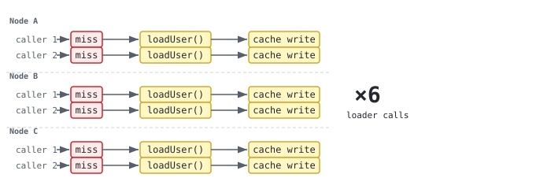
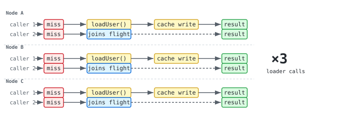
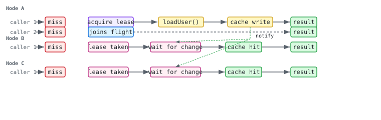
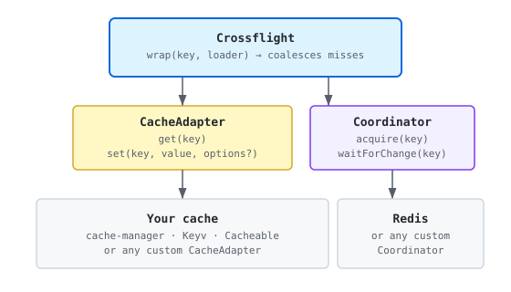

[](https://scorecard.dev/viewer/?uri=github.com/gkoos/crossflight)


# Crossflight

Cross-process cache stampede protection for the cache you already use.

```ts
const crossflight = createCrossflight({
  cache: existingCacheAdapter,
  coordinator: redisCoordinator(redis),
})

const user = await crossflight.wrap(
  "user:123",
  () => loadUser("123"),
  { ttl: 60_000 },
)
```

## What it does

When multiple processes miss the same cache key simultaneously, each of them will independently run the loader unless something coordinates between them. Most cache libraries already solve the within-process version of this problem by coalescing concurrent misses into a single in-flight Promise. That is not enough once the application runs on more than one server.

Crossflight adds a distributed coordinator to the picture. One process acquires ownership of the key, runs the loader, and writes the result to the cache. Every other caller, regardless of which process they live in, waits for that result rather than running their own copy of the same work.

### Without coalescing

Every caller across every process independently runs the loader.



### With in-process coalescing only

Callers within the same process share one in-flight Promise, but each process still runs the loader independently. This is what most cache libraries give you.



### With distributed coalescing

One process acquires ownership, runs the loader once, and writes the result. Every other caller waits for that result.



## Architecture

Crossflight is built around two separate contracts.



The `CacheAdapter` describes how values are stored and retrieved. The `Coordinator` describes how ownership is acquired and how processes signal each other when a key changes. Crossflight depends on these two interfaces and knows nothing about the backing storage or the coordination mechanism.

The cache and the coordinator do not need to be the same system. You can use cache-manager backed by Memcached for values and Redis for coordination, or any combination that satisfies the interfaces. Redis is the first coordinator implementation, not a definition of what a coordinator has to be.

## Installation

```sh
npm install crossflight ioredis
```

## Getting started

```ts
import { createCrossflight } from 'crossflight'
import { redisCoordinator } from 'crossflight/coordinators/redis'
import { cacheManagerAdapter } from 'crossflight/adapters/cache-manager'
import { Redis } from 'ioredis'

const redis = new Redis()

const crossflight = createCrossflight({
  cache: cacheManagerAdapter(cacheManager),
  coordinator: redisCoordinator(redis),
})

const value = await crossflight.wrap(
  'product:42',
  (signal) => fetchProductFromDatabase(42, { signal }),
  { ttl: 30_000 },
)

// When you're done
await crossflight.close()
await redis.quit()
```

See the [Redis coordinator guide](docs/redis-coordinator.md) for the built-in distributed coordination behavior, key layout, lease semantics, and running against a Redis Cluster.

## Adapters

Built-in adapters are available for cache-manager, Keyv, and Cacheable:

```ts
import { cacheManagerAdapter } from 'crossflight/adapters/cache-manager'
import { keyvAdapter }         from 'crossflight/adapters/keyv'
import { cacheableAdapter }    from 'crossflight/adapters/cacheable'
```

If your cache library is not on that list, the interface is two methods:

```ts
interface CacheAdapter {
  get<T>(key: string): Promise<{ hit: true; value: T } | { hit: false }>
  set<T>(key: string, value: T, options?: { ttl?: number }): Promise<void>
}
```

The reason `get` returns a discriminated union rather than a nullable value is that `undefined` is a valid cached result in many applications; a nullable return would make a genuine hit indistinguishable from a miss.

## Configuration

All options passed to `createCrossflight()`:

| Option | Type | Default | Description |
| --- | --- | --- | --- |
| `cache` | `CacheAdapter` | required | Cache backend adapter |
| `coordinator` | `Coordinator` | required | Distributed coordination backend |
| `failureMode` | `'fail-closed' \| 'fail-open'` | `'fail-closed'` | Fall back to running the loader when a coordination call fails (see [fail-open](#fail-open)) |
| `defaultTimeoutMs` | `number` | none | Per-call timeout in ms |
| `defaultTtlMs` | `number` | `30000` | Default lease TTL when a call does not pass `leaseTtlMs` (independent of the cache `ttl`) |
| `defaultFlightDeadlineMs` | `number` | none | Whole-flight deadline in ms; when it passes the flight is aborted, its lease abandoned, and late callers rejected (see [shared flight deadline](#shared-flight-deadline)) |
| `maxRetryAttempts` | `number` | `64` | Distributed retry limit before throwing `CoordinationTimeoutError` |
| `retryBackoff` | `(attempt: number) => number` | stepped 25–200ms | Wait duration per retry attempt |
| `onEvent` | `(event: CrossflightEvent) => void` | none | Observability hook |
| `onEventError` | `(error: unknown) => void` | none | Called when `onEvent` throws |
| `cacheUndefined` | `boolean` | `false` | Cache a loader result of `undefined` by writing every value into a reserved envelope (see [undefined results](#undefined-results)) |

Per-call overrides in `wrap()`: `ttl`, `leaseTtlMs`, `flightDeadlineMs`, `timeoutMs`, `failureMode`, `signal`.

The cache lifetime and the lease lifetime are separate: `ttl` controls only how long the value is cached, while the coordination lease uses `leaseTtlMs` when a call passes it, otherwise `defaultTtlMs`. A short cache lifetime therefore cannot expire the lease mid-load, and a long one cannot keep a crashed owner's lease alive. Lease TTLs are floored at 50 ms - twice the minimum renewal interval - so a lease always outlives at least one renewal.

The loader receives the shared flight's `AbortSignal`. Pass it to anything that can be cancelled - a `fetch`, a driver query - so the work stops when the flight does. A loader that ignores it still works; the flight simply stops waiting for it (see [Cancellation](#cancellation)).

### Shared flight deadline

By default a flight has no deadline of its own: each caller's `timeoutMs` bounds only that caller's wait, so a second caller joining a slow flight gets a fresh full timeout and the group's latency is bounded only by the loader.

`defaultFlightDeadlineMs` puts one budget on the whole flight, measured from the moment the flight is created. When it passes, the flight is aborted: callers waiting on it reject with `CoordinationTimeoutError`, the owner abandons its lease, and a caller that arrives afterwards is rejected immediately instead of starting a new flight - which is what keeps a deadline from becoming a stampede. `flightDeadlineMs` overrides it per call, and the call that creates a flight decides the budget its joiners inherit.

The deadline is a latency budget rather than a coordination failure, so it applies in both failure modes: `fail-open` cannot fall back to running the loader, because the flight's signal is already aborted - a loader that received that signal will have stopped, or will stop as soon as it observes it. A caller's own `timeoutMs` still bounds that caller, `maxRetryAttempts` still bounds the distributed retry loop, and `leaseTtlMs` still bounds ownership; the flight deadline is what bounds the flight as a whole.

Cache reads are raced with the flight's signal, so a stalled read cannot hold the flight past the deadline either. The cache write is the one step that cannot be interrupted: it still finishes and hands its value to the callers still attached to the flight. The deadline bounds how long the flight waits for work, and aborting it is what releases the lease.

### Undefined results

Every built-in adapter reports a stored `undefined` as a miss, because that is what the underlying backends return for a missing key. A loader that resolves `undefined` is therefore never cached: each caller runs it again.

`cacheUndefined: true` closes that gap. While it is on, every value Crossflight writes goes into the reserved envelope `{ "__crossflight_envelope__": 1, value }` - a loader result of `undefined` is the same envelope without a `value` key - and is unwrapped on read. Wrapping every value is what makes the format unambiguous: whatever your loader returns comes back exactly as it was, including an object that looks like the envelope itself.

Raw values written by a process that has the option off still read back as they were. Two processes sharing a cache, however, have to agree on the setting: an option-off process reading an enveloped value sees the envelope, not the value, and anything else reading those keys directly has to unwrap it too.

## Errors

When coordination fails, Crossflight throws one of four typed errors, all extending `CoordinationError`. `CoordinationClosedError` is thrown if `close()` is called while a `wrap()` is still running. `CoordinationTimeoutError` is thrown when the per-call timeout elapses, the flight deadline passes, or the distributed retry limit is exhausted, and carries a `key` property. `OwnershipLostError` is thrown to the owner process when a periodic lease renewal confirms the lease is gone (`renew()` returns `false`); it surfaces through `onEvent` as a `failed` event and the owner's `wrap()` call rejects. The one exception is publication: when ownership is lost while the cache write is already in flight, the value is still published - the write cannot be cancelled and deleting it afterwards could remove the newer owner's value - so `failed` is reported and `wrap()` resolves with the published value (see [failure semantics](#failure-semantics)).

| Class | When thrown |
| --- | --- |
| `CoordinationError` | Base class. |
| `CoordinationClosedError` | `close()` was called while a `wrap()` was in flight. |
| `CoordinationTimeoutError` | Per-call timeout elapsed or distributed retry limit exhausted. Has a `key` property. |
| `OwnershipLostError` | Periodic lease renewal confirmed ownership is gone (`renew()` returned `false`). The owner's `wrap()` rejects with this error. Has a `key` property. |

```ts
import { CoordinationError, CoordinationTimeoutError } from 'crossflight'

try {
  const value = await crossflight.wrap('key', loadValue)
} catch (error) {
  if (error instanceof CoordinationTimeoutError) {
    console.error(`Gave up waiting for key: ${error.key}`)
  } else if (error instanceof CoordinationError) {
    console.error('Coordination failed:', error.message)
  } else {
    throw error
  }
}
```

## Events

The `onEvent` hook receives a `CrossflightEvent` on every significant state change. All events carry at least `type` and `key`.

| Event type | Trigger | Extra fields |
| --- | --- | --- |
| `hit` | Cache hit — value returned without coordination | `waitedMs` |
| `miss` | Cache miss — coordination starting | — |
| `local_join` | Caller joined an existing in-process flight for the same key | — |
| `distributed_join` | Caller is waiting for a remote owner to complete | — |
| `wait_exhausted` | Retry budget ran out while the lease stayed contended | `attempts` |
| `ownership_acquired` | This process acquired the lease and will run the loader | — |
| `fallback` | `fail-open` ran the loader without owning the lease | `reason` |
| `cancelled` | This caller's own wait ended (`signal` fired or `timeoutMs` elapsed) | `reason` |
| `completed` | Owner finished, result written to cache | `durationMs`, `waitedMs` |
| `failed` | Any failure: coordination error, loader error, or ownership loss | `error` |
| `renewal_failed` | Periodic lease renewal threw during owner execution; owner will abort | `error` |

Each failure produces exactly one `failed` event. Coordination errors that surface from an inner catch are not reported again when they reach the caller, so `onEvent` consumers can count `failed` events directly without deduplicating.

`waitedMs` reports how long the caller waited on another owner before the value arrived, and is `0` when the first read hit — so you can measure whether coalescing actually saves loader work. `fallback` counts the calls that ran the loader without owning the lease, and `wait_exhausted` shows when the retry budget, rather than the caller's own timeout, ended the wait.

`renewal_failed` fires immediately before the owner aborts. It is always followed by a `failed` event. Use it to distinguish renewal-specific failures from loader failures in your observability tooling.

## Failure semantics

Distributed coalescing is a best-effort reduction of redundant work, not a guarantee that the loader runs exactly once. While the owner is executing the loader - and while it publishes the result - Crossflight periodically renews the lease to keep ownership valid for long-running work. If an owner process fails after completing the loader but before writing the result to cache, the lease eventually expires and another process takes over. Loaders should therefore tolerate running more than once under failure conditions.

The guarantee Crossflight offers is narrower: under normal operation, concurrent misses for the same key across all participating processes produce one loader execution, and every waiting caller receives that result.

Ownership is released on every exit path: the owner completes the lease after the cache write, and abandons it when the loader fails, the flight aborts, or the ownership recheck finds a value another process already cached.

Because renewal keeps running until the publication settles, a slow write cannot lose the lease and let a newer owner be overwritten. One window remains: if a renewal fails while the write is in flight, the value is still published - a cache write cannot be cancelled, and deleting it afterwards could remove the newer owner's value instead - and the flight reports `failed` (plus `renewal_failed` when the renewal threw) before emitting `completed`. Closing that window requires the store itself to reject a stale write, through a conditional write or a fencing token, which `CacheAdapter` cannot express today; treat a `failed` reported during publication as a signal that the cached value may be stale. A cache write that never settles keeps the lease renewed for as long as the owner lives: letting the lease lapse underneath a live write is exactly what publishes stale values, so bound slow writes in your store or adapter if a hung write matters to you.

### fail-open

`failureMode: 'fail-open'` is about a **failed** coordination call, not about losing the race for the lease. When `acquire()`, `waitForChange()` or a re-acquire throws, Crossflight reports a `failed` event and runs the loader itself instead of rejecting the caller.

Ordinary contention is different: `acquire()` resolving `null` means another owner holds the lease, so the caller still joins the distributed wait and serves that owner's result - exactly as it does under `fail-closed`. Only if the retry budget runs out while the lease stays contended does fail-open report a `failed` event carrying `CoordinationTimeoutError` and fall back to the loader (fail-closed rejects with the same error instead). Without that distinction, fail-open would run the loader on every contended miss and recreate the stampede it is meant to prevent.

### Renewal-failure policy

When periodic lease renewal fails during owner execution, Crossflight follows a **fail-fast** policy: the owner aborts immediately, the lease is abandoned, and another process can reacquire ownership. This applies whether renewal fails because `renew()` throws (e.g. a Redis command timeout) or because `renew()` returns `false` (confirmed ownership loss). The abort is not held back by the loader: `wrap()` rejects with the renewal error as soon as it fires, and the abort signal lets the loader stop its own work.

This is the only policy. A best-effort alternative — swallowing transient renewal errors and continuing the loader — was considered and rejected: without a coordinator-specific contract there is no reliable way to distinguish a transient blip from a permanent failure, and if the lease has already expired on the coordinator side, the loader is running without ownership regardless. The fail-fast policy makes failure visible and deterministic.

To reduce unnecessary aborts under short-lived coordinator disruptions, tune two knobs:
- **`defaultTtlMs`** (or per-call `leaseTtlMs`): increase the lease TTL so the lease survives longer before expiring, giving the coordinator more time to recover before a renewal failure forces an abort.
- **`commandTimeoutMs`** on the Redis coordinator: a short command timeout causes renewals to throw quickly on a blip, triggering an abort. Raising it allows the renewal to wait longer for a slow Redis before giving up.

## Cancellation

Passing an `AbortSignal` to `wrap()` cancels that caller's participation, and `timeoutMs` bounds that caller's own wait. Both are scoped to the individual caller: they reject only that caller, and if other callers are waiting on the same flight the loader and the coordination lease continue unaffected. The shared flight is cancelled only when the **last** waiting caller cancels or when `close()` is called; otherwise it ends when the owner completes or abandons it. A cancelled caller receives its own reason (`signal.reason` or `CoordinationTimeoutError`).

The signal handed to the loader is the flight's own signal, not any one caller's. When the flight aborts - the last caller cancels, `close()` is called, or the lease is lost - Crossflight stops waiting for the loader immediately, reports a single `failed` event, and abandons the lease. The loader keeps running until it observes the signal, so give it a way to stop: `wrap('product:42', (signal) => fetchProduct(42, { signal }))`. A cache write is not abortable, so ownership is held until it settles: renewal keeps running while the write is in flight, and the lease is completed afterwards, so a replacement owner cannot publish a newer value that this write would then overwrite. If ownership is genuinely lost mid-write - a renewal reports the lease as gone - the write still lands and the store keeps the last write (see [failure semantics](#failure-semantics)).

## Scope

Crossflight coordinates cache misses and nothing else. Managing stored values, enforcing TTLs, handling eviction, serialization, and invalidation all remain the responsibility of your cache.

### Alternatives

**Redis locks** are the most common approach to this problem. A distributed lock wraps the loader directly, which works, but it couples coordination and caching together, requires careful TTL tuning to avoid blocking callers permanently when the owner crashes, and leaves you writing the same retry-and-wait loop for every resource you want to protect.

**[LayerCache](https://github.com/flyingsquirrel0419/layercache)** and similar unified caching frameworks solve the problem by owning the entire caching layer. The coordination is built in, but so is the migration - your TTL configuration, serialization, invalidation, and data layer all need to move to the new system.

Crossflight wraps the cache you already have. Coordination is handled by a separate coordinator, the cache contract is two methods, and nothing about your existing storage layer changes.

### Performance

The overhead on a cache hit is negligible (a Map lookup and a resolved Promise). The benefit comes from stampede reduction: in my measurements under realistic concurrent load, eliminating redundant loader executions produces a 2–5% throughput gain. That is enough to consider adding Crossflight alongside an existing cache without any migration, although it may not be a number that would justify rebuilding your caching layer or tolerating the ongoing maintenance of a hand-rolled Redis lock.

The repository includes a benchmark suite that exercises coalescing under configurable concurrency and loader latency. See [docs/benchmark.md](docs/benchmark.md) for how to run it and what the results measure.

## Extending

- [Creating a cache adapter](docs/creating-an-adapter.md)
- [Creating a coordinator](docs/creating-a-coordinator.md)
- [Redis coordinator](docs/redis-coordinator.md)

## License

MIT
